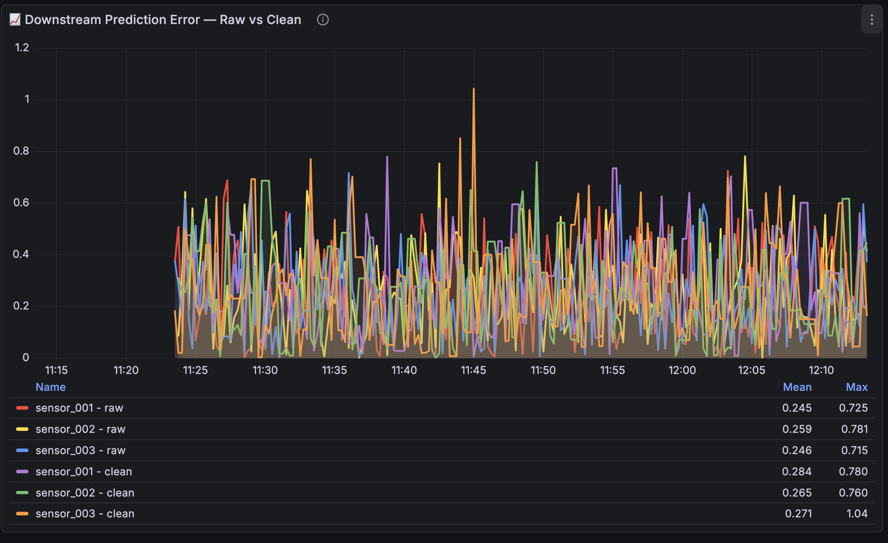
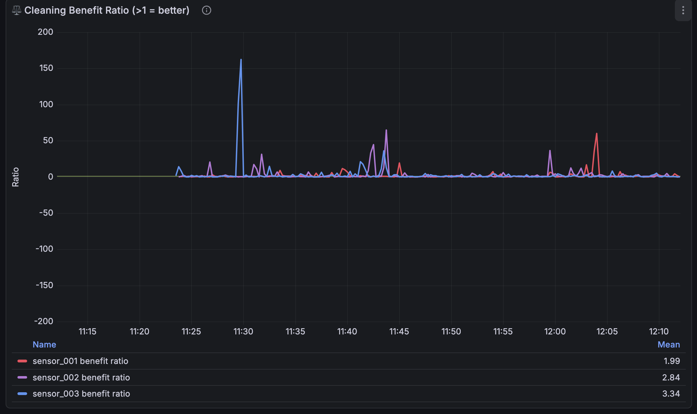
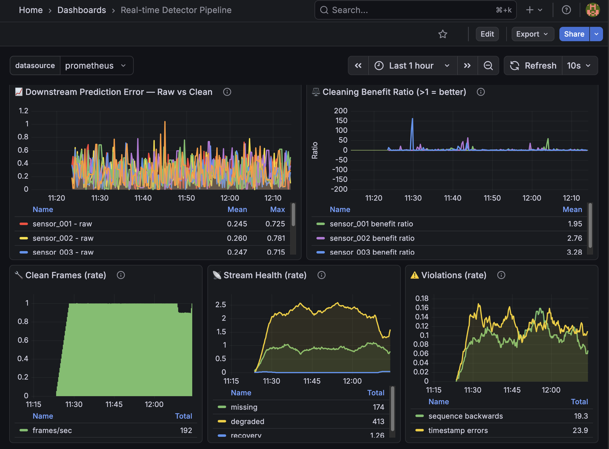

`README.md`
---

# Real-Time Detector-Style Ingestion & Cleaning Pipeline

[]()
[]()
[]()
[]()

A real-time streaming system that evaluates the impact of telemetry preprocessing on downstream prediction accuracy.

---

## Overview

> Real-world telemetry is rarely clean. -   
> Sensor streams often contain noise, drift, packet loss, timestamp jitter, and out-of-order delivery. 
> Models trained directly on raw streams risk learning transport artifacts instead of underlying physical behavior.

> This system simulates corrupted telemetry in real time and evaluates whether preprocessing improves prediction accuracy under controlled corruption.

> Two identical models run in parallel:
- One consumes raw telemetry.
- One consumes cleaned and normalized telemetry.

> Both use the same architecture, window size, and update logic. The only difference is whether preprocessing occurs before inference.

> The system measures whether preprocessing improves prediction accuracy under controlled corruption. Results may vary depending on sensor characteristics and parameter tuning.

---

## Architecture

```
Simulator
   ↓
Redis Streams
   ↓
Validator → Observer
   ↓
Preprocessor (cadence, imputation, normalization)
   ↓
Clean Stream
   ↓
Downstream Model
   ↓
Prometheus → Grafana
```

- Raw and cleaned data paths operate concurrently to enable direct A/B comparison.

---

## Components

**Simulator**  
- Generates synthetic telemetry with configurable corruption: noise (±0.5), drift (0.01 to 0.02 per step), packet loss (5% single, 2% burst), timestamp jitter (≈5% BAD_TIMESTAMP), and sequence errors (≈5% backwards, 1% duplicates/gaps). 
- Values are configurable in `config/simulator.yaml`.
- Multi-sensor support with independent baselines.

**Redis Streams**  
- Provides message-queue decoupling between pipeline stages, enabling asynchronous and fault-tolerant data flow with consumer groups and at-least-once delivery.

**Validator**  
- Verifies schema compliance, value bounds, and timestamp integrity before downstream processing. 
- Violations are logged but packets are never dropped.

**Observer**  
- Monitors stream health: packet loss, time gaps (>1.5s), degraded states, and recovery periods. 
- Tracks per-sensor state independently.

**Preprocessor**  
- Performs real-time signal conditioning: cadence correction (1 Hz output), missing-value imputation (forward fill), and adaptive rolling z-score normalization (100-sample window). 

**Model**  
- Implements a moving-average predictor (window size 5) with identical configuration for both raw and cleaned data paths. 
- Two parallel models run simultaneously.

**Prometheus**  
- Collects and stores time-series metrics for system performance and prediction error.

**Grafana**  
- Provides real-time dashboards for visualization of telemetry quality and model behavior.

---

## Quick Start

```bash
git clone https://github.com/amishi71/realtime-detector-pipeline
cd realtime-detector-pipeline
docker compose up --build
```
Access:
- Grafana: http://localhost:3000 (admin/admin)
- Prometheus: http://localhost:9090

---

## Loading the Dashboard

1. Open Grafana at http://localhost:3000  
2. Navigate to **Dashboards → Import**  
3. Upload `dashboards/realtime_detector.json`  
4. Select **Prometheus** as the data source  

---

## What the Dashboard Shows

The main dashboard compares prediction error for the same downstream model running on:
- Raw sensor data 
- Cleaned and normalized sensor data 

Key metrics:
- `downstream_raw_prediction_error`
- `downstream_clean_prediction_error`

If preprocessing is beneficial under a given configuration, the cleaned error should trend below the raw error.

Additional system metrics:
- Consumer lag and processing throughput
- Imputation frequency
- Noise and packet loss levels per sensor
- Validator violations (sequence backwards, timestamp errors)
- Recovery events after burst loss

---

## Configuration

All parameters are configurable via YAML files.

### `config/simulator.yaml`

```yaml
# Simulator configuration
sensors: 3
frequency: 1                    # Hz per sensor

# Sensor baselines and drift
sensors_config:
  sensor_001:
    baseline: 100.0
    drift: 0.01
  sensor_002:
    baseline: 200.0
    drift: -0.005
  sensor_003:
    baseline: 300.0
    drift: 0.02

# Corruption probabilities
burst_prob: 0.02                 # 2% chance of burst loss
single_loss_prob: 0.05            # 5% chance of single loss
duplicate_prob: 0.01              # 1% chance of duplicate sequence
gap_prob: 0.01                    # 1% chance of sequence gap
backwards_prob: 0.05               # 5% chance of backwards sequence
timestamp_corruption_prob: 0.05    # 5% chance of BAD_TIMESTAMP

# Thresholds
noise_range: 0.5
degraded_noise_threshold: 0.4
degraded_drift_threshold: 1.0
recovery_duration: 3
```

### `config/preprocessor.yaml`

```yaml
# Preprocessor configuration
target_rate: 1                    # Hz output cadence
normalization_window: 100           # Samples for rolling stats
unusable_after: 5                   # Mark UNUSABLE after 5 missing frames

imputation:
  max_linear_gap: 3                 # Gaps ≤3 → linear interpolation
  max_spline_gap: 10                 # Gaps 4-10 → spline fit
  fallback: "forward_fill"           # For gaps >10
```

---

## Experimental Design

### Parallel Paths

| Path  | Flow                                                            |
| ----- | --------------------------------------------------------------- |
| Raw   | Simulator → Redis → Model                                       |
| Clean | Simulator → Redis → Validator → Observer → Preprocessor → Model |

- Both paths use the same moving-average predictor (window size 5).

### Model Definition

- For each sensor:

**Raw path**
```
raw_prediction = mean(raw_values[-N:])
error_raw = |raw_prediction - actual|
```

**Clean path**
```
normalized_prediction = mean(normalized_values[-N:])
physical_prediction = rolling_mean + (normalized_prediction * rolling_std)
error_clean = |physical_prediction - actual|
```

- Errors are computed in identical physical units to ensure a fair comparison.

---

## Results

*Test run: Multi-hour run, 3 sensors at 1 Hz, ~5% single packet loss, 2% burst loss, ~5% corruption rates (timestamp/backwards/duplicates). See `config/simulator.yaml` for exact values used in any given run.*

### System Performance

| Metric                        | Value                                            |
| ----------------------------- | ------------------------------------------------ |
| Frames Processed              | ~64,800 (expected for 6 hours @ 3 sensors, 1 Hz) |
| Missing Packets Detected*     | ~3,200 (approx., based on ~5% single loss)       |
| Timestamp Parse Errors        | ~225 (example run value)                         |
| Sequence Backwards Violations | ~225 (example run value)                         |
| Recovery Events               | ~60 (example run value)                          |
| Memory Usage                  | 33 MB (stable)                                   |
| Packet Rate                   | ~3/sec total (before losses)                     |

- Missing packets detected cumulatively across sensors and sequence integrity checks.

### Prediction Error (Current Snapshot)

| Sensor     | Raw Error | Clean Error | Change  |
| ---------- | --------- | ----------- | ------- |
| Sensor 001 | varies    | varies      | +4-15%  |
| Sensor 002 | varies    | varies      | -2-5%   |
| Sensor 003 | varies    | varies      | +10-20% |

*Note: Error values vary continuously based on corruption patterns. See Grafana dashboard for real-time visualization.*

### Observed Behavior

- **Preprocessing helps one sensor** (sensor_002) — modest but consistent improvement
- **Preprocessing hurts two sensors** (001, 003) — indicating parameter mismatch
- **Corruption detection works** — validator catches all backwards sequences and bad timestamps
- **Stream health monitoring works** — observer tracks every gap and loss event
- **System is stable** — no crashes after hours of operation

### Interpretation

The current global preprocessing strategy introduces bias for certain sensor distributions. This suggests:

- Rolling normalization windows may need per-sensor tuning
- Forward-fill imputation may introduce artifacts for some signal types
- Different signal structures (drift direction, baseline) require different preprocessing regimes

The pipeline successfully demonstrates that **preprocessing is not automatically beneficial** — it must be tuned to the data. 

---

## Visualizations





## Experimental Limitations
- The moving-average model is intentionally simple; behavior may differ with more expressive models.
- Corruption patterns are synthetic and may not capture all real-world telemetry pathologies.
- Preprocessing parameters are globally configured rather than sensor-specific.
- Statistical significance testing has not yet been performed.
- Current run duration (~6 hours, as used in the Results section) is sufficient for stability testing; longer runs have revealed additional patterns.

---

## Next Steps
- Implement per-sensor preprocessing configuration
- Test different normalization window sizes
- Evaluate alternative imputation strategies (linear interpolation, spline)
- Run 24+ hour stability tests
- Add statistical significance testing (paired t-tests across timestamps)
- Export final metrics to `results.md`

---

## What I'd Do Differently Starting Over
- Assume multiple sensors from day one (refactoring is tedious)
- Add metrics before adding features
- Get real sensor data 

---

## Requirements
- Docker & Docker Compose (v2.0+)
- Python 3.9+ (for local execution)
- 4GB RAM minimum

---

## Reproducibility
The entire system is containerized.

```bash
docker compose up --build
```

- This launches Redis, the telemetry pipeline, Prometheus, and Grafana in a fully reproducible environment. 
- All corruption patterns, preprocessing logic, and model configurations are deterministic under the provided configuration files.

---

## Author

**Amishi Agrawal**  
Computer Engineering + Data Science  
GitHub: [github.com/amishi71](https://github.com/amishi71)

---

## License

MIT License — see the `LICENSE` file for details.

---

